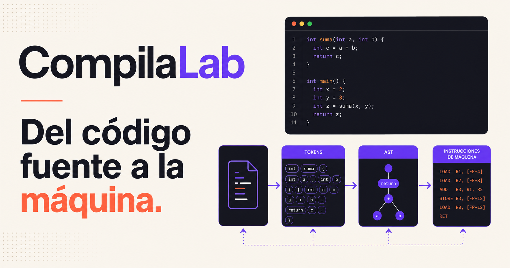

<div align="center">



# CompilaLab

### Aprende cómo un programa se transforma desde código fuente hasta código ejecutable.

[](https://compiladores.kynova.tech)


</div>

---

## ¿Qué es CompilaLab?

CompilaLab es una plataforma educativa interactiva creada para el curso de **Compiladores 2026**. Convierte los conceptos abstractos del curso en explicaciones sencillas, ejemplos visuales y laboratorios que responden inmediatamente a lo que escribe el estudiante.

El contenido sigue un recorrido de **21 semanas**, desde los fundamentos del procesamiento de lenguajes hasta la generación y optimización de código.

## Lo que puedes hacer

| Área | Experiencia |
| --- | --- |
| 📚 **Aprender** | Recorrer las 21 semanas con objetivos, temas y ejemplos guiados. |
| 🧪 **Practicar** | Modificar entradas y observar cómo cambia cada representación. |
| ✅ **Validar** | Recibir mensajes claros sobre entradas correctas y errores. |
| 📝 **Repasar** | Resolver cuestionarios con explicación de cada respuesta. |
| 📈 **Avanzar** | Marcar semanas completadas y conservar el progreso en el navegador. |

## Laboratorios interactivos

- **Tokenizador:** clasifica palabras reservadas, identificadores, números y operadores.
- **Expresiones regulares:** comprueba si un lexema cumple un patrón.
- **AFN y AFD:** recorre estados y decide si una cadena pertenece al lenguaje.
- **Gramáticas:** valida expresiones y muestra derivaciones.
- **Parser y AST:** comprueba la sintaxis y construye una representación del árbol.
- **Tabla de símbolos:** detecta declaraciones y variables utilizadas incorrectamente.
- **Código intermedio:** genera instrucciones de tres direcciones.
- **Pipeline completo:** sigue el mismo programa a través de todas las fases.

## Recorrido académico

```text
Código fuente
     ↓
Análisis léxico ──→ Tokens
     ↓
Análisis sintáctico ──→ AST
     ↓
Análisis semántico ──→ Tabla de símbolos
     ↓
Representación intermedia ──→ TAC
     ↓
Optimización y código final
```

## Tecnologías

- **Next.js + React** para la experiencia web.
- **TypeScript** para mantener el código seguro y comprensible.
- **CSS responsivo** para escritorio, tablet y teléfono.
- **Node.js 22** como entorno de ejecución.
- **Docker** para una construcción reproducible.
- **Coolify** para despliegue automático en VPS.

## Ejecutar localmente

Necesitas Node.js 22 o superior.

```bash
git clone https://github.com/jaestrada40/compiladores.git
cd compiladores
npm ci
npm run dev
```

Abre [http://localhost:3000](http://localhost:3000).

## Verificación

```bash
npm run lint
npm test
npm run build
```

## Desplegar con Docker

```bash
docker build -t compilalab .
docker run --rm -p 3000:3000 compilalab
```

## Desplegar en Coolify

| Configuración | Valor |
| --- | --- |
| Repositorio | `https://github.com/jaestrada40/compiladores` |
| Rama | `main` |
| Build Pack | `Dockerfile` |
| Puerto expuesto | `3000` |
| Dominio | `https://compiladores.kynova.tech` |

No se requieren variables de entorno para la versión actual. El progreso se guarda localmente en el navegador del estudiante.

---

<div align="center">

**CompilaLab · Laboratorio de Compiladores 2026**

Construido para aprender haciendo.

</div>
